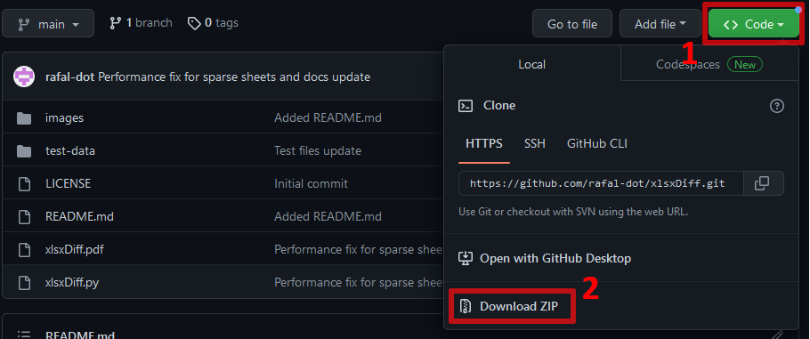
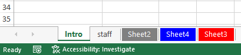
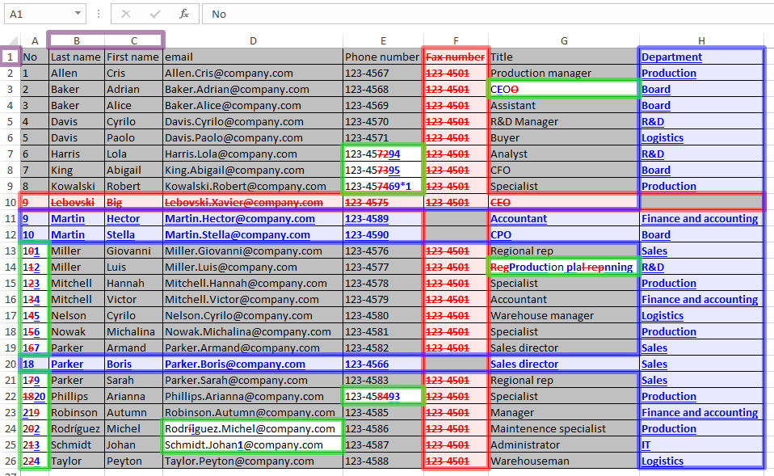

# `xlsxDiff`


Compare two Excel `.xlsx` files, tab-by-tab, column/row-by-column/row and
cell-by-cell, with visualization similar to changes tracking feature in Word

# INTRODUCTION

I myself have desired to compare two complex Excel spreadsheets many times. I
was especially interested in finding things like:

1. minor modifications to texts in cells,
2. modifications to numbers,
3. changes to formulas,
4. added/removed columns and rows,
5. modified/added/removed tabs.

Unfortunately, all the solutions I could find were limited to a simple binary
comparison of relevant cell values. It helps a lot, but is often too general
and requires a huge extra effort to precisely identify changes made. Since I
couldn't find a suitable solution, I finally got annoyed and wrote a solution
myself which I am making available as open source.

The main purpose of this tool is to fill the gap and facilitate the search and
visualization of changes made between file versions, with an emphasis on the
ability to track changes made at the level of individual cells, columns/rows
and tabs with visualization similar to changes tracking feature in Word. This
script ignores all other changes made, like changes in formatting. However, it
is easier to quickly identify where such general changes have been made and
after minor manual interventions in the input files it is easy to get a
comprehensive and clear picture of all changes made.

## FILES IN REPOSITORY

There are following files:
- [`xlsxDiff.pdf`](xlsxDiff.pdf) - documentation file with multiple examples,
  delatiled options description and FAQ
- [`xlsxDiff.py`](xlsxDiff.py) - main script, single file
- [`LICENCE`](LICENSE) - GNU Affero General Public License file
- [`README.md`](README.md) - this file
- [`test-data/`](test-data) - directory with examples

# INSTALLATION

## Download `xlsxDiff`

To download `xlsxDiff`, just do one of the following:

- download the compressed archive from the repository page
  [GitHub](https://github.com/rafal-dot/xlsxDiff) (see `Code`/`Download ZIP`
  button):



or

- execute a `git clone`:
```commandline
git clone https://github.com/rafal-dot/xlsxDiff.git
```

## Python download and installation

To avoid legal challenges, I suggest using the standard Python distribution,
which can be found at [https://www.python.org/downloads/windows/]

For any Unix distribution you probably already have Python installed.

I do not use macOS, but you can also find a distribution for this system.

## Installation of `OpenPyXL` and `XlsxWriter` modules

Install two necessary modules being used by `xlsxDiff`, that allow to
manipulate `.xlsx` files:

```commandline
pip install openpyxl xlsxwriter
```

# USE

## BASIC USE

Using `xlsxDiff` is simple, in Windows environment just run cmd and call the
script with three parameters: two input files and output file:

```commandline
python xlsxDiff.py in1.xlsx in2.xlsx out.xlsx
```


Added fragments of text strings are
<span style="color:blue"><u>blue and underlined</u></span>
and removed fragments of text strings are
<span style="color:red">~~red and crossed out~~</span>. Unchanged cells have a
gray background.

### CHANGES IN TABS



Tabs are highlighted as follows: (i) changed tabs are
<span style="color:white">white</span>, (ii) added tabs are
<span style="color:blue">blue</span>, (iii) removed tabs are
<span style="color:red">red</span> and (iv) tabs without changes are
<span style="color:grey">grey</span>. More detailed changes are visible in
individual cells in the appropriate tabs, as described in the previous section.

## CHANGES IN FORMULAS

If you add `-f` option, formulas will be compared instead of data:

```commandline
python xlsxDiff.py in1.xlsx in2.xlsx out.xlsx -f
```


## Visualize changes in entire rows and columns

It is possible to track changes in columns and rows and, respectively,
changes in other cells:
```commandline
python xlsxDiff.py in1.xlsx in2.xlsx out.xlsx -c staff!B,C -r staff!1
```

Please see elements highlighted[^1]:
- <span style="color:purple">Purple</span>: in tab `staff` columns `B` and `C`
  are used as index to identify changes in rows (option `-c staff!B,C`), and
  `1`<sup>st</sup> row is used as index to identify changes in columns (option
  `-r staff!1`);
- <span style="color:blue">Blue</span>: added columns/rows. All text in the
  cell is <span style="color:blue"><u>blue and underlined</u></span>;
- <span style="color:red">Red</span>: removed columns/rows. All text in the
  cell is <span style="color:red">~~red and crossed out~~</span>;
- <span style="color:green">Green</span>: changes inside cells. Necessary cell
  position adjustments after inserting and/or deleting columns and/or rows are
  included. Added fragments of text strings are
  <span style="color:blue"><u>blue and underlined</u></span> and removed
  fragments of text strings are
  <span style="color:red">~~red and crossed out~~</span>.

# LICENCE

Copyright (C) 2020-2023 Rafał Czeczótka

This program is free software: you can redistribute it and/or modify it under
the terms of the GNU Affero General Public License as published by the Free
Software Foundation, either version 3 of the License, or (at your option) any
later version.

This program is distributed in the hope that it will be useful, WITHOUT ANY
WARRANTY; without even the implied warranty of MERCHANTABILITY or FITNESS FOR A
PARTICULAR PURPOSE. See the GNU Affero General Public License for more details.

You should have received a copy of the GNU Affero General Public License along
with this program. If not, see [https://www.gnu.org/licenses/].

[^1]: Coloured boundary lines are manually overlayed (i.e. are not included in
Excel spreadsheet) to facilitate visualisation of changes. All other formats
are just screenshot from Excel
