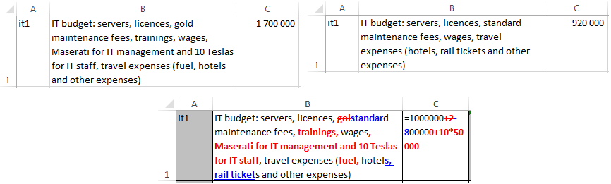

# `xlsxDiff`


Compare two Excel `.xlsx` files, cell-by-cell, with visualization similar to
changes tracking feature in Word

# INTRODUCTION

I myself have desired to compare two complex Excel spreadsheets many times. I
was especially interested in finding things like minor modifications to texts
in cells, modifications to numbers, or changes to formulas. Unfortunately, all
the solutions I could find were limited to a simple binary comparison of cell
values, which helps a lot, but is often too general and requires a huge extra
effort to precisely identify changes made. Since I couldn't find a suitable
solution, I finally got annoyed and wrote a solution myself which I am making
available as open source.

The main purpose of this tool is to fill the gap and facilitate the search and
visualization of changes made between file versions, with an emphasis on the
ability to track changes made at the level of individual cells with
visualization similar to changes tracking feature in Word. This script ignores
all other changes made, like removing/adding/changing order of
rows/columns/tabs, changes in formatting etc. However, it is easier to quickly
identify where such general changes have been made and after minor manual
interventions in the input files it is easy to get a comprehensive and clear
picture of all changes made.

## FILES IN REPOSITORY

There are following files:
- [`xlsxDiff.pdf`](xlsxDiff.pdf) - documentation file with multiple examples,
  delatiled options description and FAQ
- [`xlsxDiff.py`](xlsxDiff.py) - main script, single file
- [`LICENCE`](LICENSE) - GNU Affero General Public License file
- [`README.md`](README.md) - this file
- [`test-data/`](test-data) - directory with examples

# INSTALLATION

## Download `xlsxDiff`

To download `xlsxDiff`, just do one of the following:

- download the compressed archive from the repository page
  [GitHub](https://github.com/rafal-dot/xlsxDiff) (see `Code`/`Download ZIP`
  button)

or

- execute a git clone:
```
git clone https://github.com/rafal-dot/xlsxDiff
```

## Python3 Download and installation

To avoid legal challenges, I suggest using the standard Python distribution,
which can be found at [https://www.python.org/downloads/windows/]

For any Unix distribution you probably already have Python installed.

I do not use macOS, but you can also find a distribution for this system.

## Installation of `OpenPyXL` and `XlsxWriter` modules

Install two necessary modules being used by `xlsxDiff`, that allow to
manipulate `.xlsx` files:

```
pip install openpyxl xlsxwriter
```

# USE

Using `xlsxDiff` is simple, in Windows environment just run cmd and call the
script with three parameters: two input files and output file:

```
python xlsxDiff.py in1.xlsx in2.xlsx out.xlsx
```


If you add `-f` option, formulas will be compared instead of data:

```
python xlsxDiff.py in1.xlsx in2.xlsx out.xlsx -f
```



# LICENCE

Copyright © 2020-2023 Rafał Czeczótka

This program is free software: you can redistribute it and/or modify it under
the terms of the GNU Affero General Public License as published by the Free
Software Foundation, either version 3 of the License, or (at your option) any
later version.

This program is distributed in the hope that it will be useful, WITHOUT ANY
WARRANTY; without even the implied warranty of MERCHANTABILITY or FITNESS FOR A
PARTICULAR PURPOSE.  See the GNU Affero General Public License for more
details.

You should have received a copy of the GNU Affero General Public License along
with this program.  If not, see [https://www.gnu.org/licenses/].
